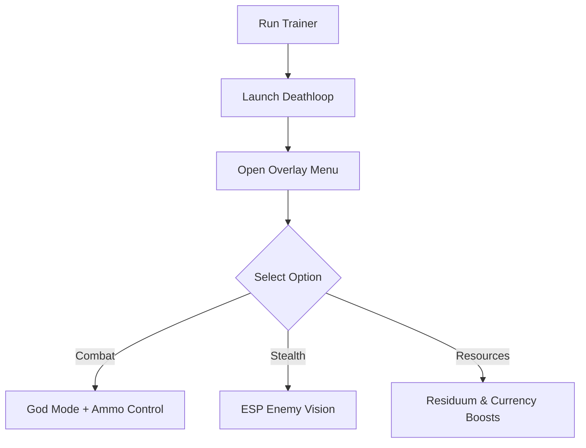

# Deathloop Trainer ⚔️

The **Deathloop Trainer Software** gives you full control over Arkane’s stylish time-loop shooter. With **combat power-ups, resource editing, and stealth tools**, it transforms the game into a customizable sandbox where you can experiment with routes, powers, and strategies without restrictions.

[](#)
[](#)
[](#)
[](#)

---

## 📝 Overview

Deathloop thrives on creativity, but mastering its systems can be demanding. The trainer helps you skip grind and focus on fun with **god mode, infinite ammo, residuum boosts, and one-hit kills**. Perfect for exploring multiple story paths, testing weapon builds, or simply enjoying chaos.

\[!IMPORTANT]
The trainer works in memory only. It will not permanently alter saves unless you choose to save with cheats enabled.

---

## ⭐ Features

* **God Mode** – Explore and fight without taking damage.
* **Infinite Ammo & No Reload** – Keep firing without limits.
* **Residuum Boost** – Max out your resources instantly.
* **One-Hit Kills** – Eliminate enemies with a single shot.
* **Stealth ESP** – Reveal enemies and traps through walls.
* **Overlay Menu** – Enable, disable, and tweak cheats mid-run.

---

## 🖥 Compatibility

| Platform          | Supported | Notes              |
| ----------------- | --------- | ------------------ |
| Windows 10/11     | ✅         | Fully supported    |
| Steam             | ✅         | Stable integration |
| Bethesda Launcher | ✅         | Compatible         |
| Linux (Proton)    | ⚠️        | Experimental only  |
| Consoles          | ❌         | Not supported      |

\[!NOTE]
Accessibility: The overlay supports scalable text, high-contrast palettes, and simplified menus for easier use.

---

## ⚡ Setup Guide

1. **Download** the Deathloop Trainer package.
2. Extract files into your Deathloop install folder.
3. Run `DeathloopTrainer.exe` as administrator.
4. Launch the game and press `F1` to bring up the overlay.
5. Configure features in the panel or edit `config.ini`.

```ini
[trainer]
godmode=true
ammo=infinite
reload=off
one_hit_kills=false
residuum=999999
```

---

## 🔄 Trainer Workflow



---

## ❓ FAQ

**Q: Can I use this in online invasions?**
A: No, the trainer is designed for **single-player only**.

**Q: Does it affect campaign progression?**
A: No, the story remains unchanged.

**Q: Can I toggle features during a mission?**
A: Yes, hotkeys and overlays allow instant changes.

**Q: Will it damage my saves?**
A: No, unless you intentionally save with cheats enabled.

**Q: Can I save multiple profiles?**
A: Yes, different configs can be saved for stealth, combat, or farming runs.

---

## 🚀 Final Thoughts

The **Deathloop Trainer Software** puts the loop in your hands with **god mode, infinite ammo, residuum boosts, and stealth ESP**. Whether you want to test powers, dominate combat, or just enjoy stress-free exploration, this trainer is your key to freedom.

---

